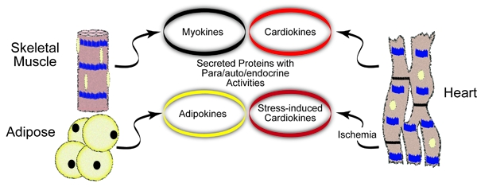

Communication between individuals of a society is essential for effective functioning of the whole. Tissues, organs and organisms are, in essence, societies of cells that must communicate over short and long distances. Communication between cells depends upon secretion, which is the process by which substances are transferred across an intact plasma membrane from intracellular to extracellular spaces. The heart is comprised of numerous cell types that, via secretion, communicate with each other, as well as with cells in other, sometimes distant tissues. Although the chemical nature of the molecules secreted by the heart is varied, most substances secreted by the heart are proteins, which we call cardiokines. Cardiokines and their receptors constitute the equivalent of a molecular social network that is organized to optimize interactions between cells in the heart, as well as communication between the heart and other tissues. As critical elements of this network, cardiokines contribute in a combinatorial fashion to the intricate communication system that forms the basis of acute and chronic responses of the cells in the heart to environmental cues.

The archetype cardiokine, atrial natriuretic peptide (ANP), the first element of the molecular social network in the heart to be identified. We have studied ANP because it is a critical endocrine/paracrine signaling cardiokine that regulates blood pressure, as well as protecting the heart from ischemic damage. Moreover, we examine ANP because it is synthesized and secreted from cardiac myocytes in the heart via a novel mechanism that is unlike any other secreted protein. Accordingly, our studies on ANP have clear translational potential.

Another cardiokine currently being studied in the lab is the recently discovered protein, mesencephalic astrocyte-derived neurotrophic factor (MANF). The expression of MANF is increased in the ischemic heart, in part, through activation of ER stress, a condition that drastically impairs the expression and secretion of most other cardiomyokines. This novel function of MANF suggests that it may have important roles in the ischemic heart. Consistent with this are recent findings showing that MANF protects against ischemic damage. Accordingly, MANF has translational potential as a novel therapy for ischemic heart disease.
