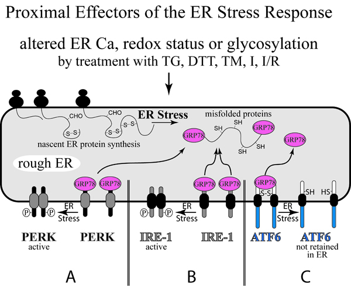

Over the last decade, it has become clear that the accumulation of misfolded proteins contributes to a number of neurodegenerative, immune and endocrine pathologies, as well as other age-related illnesses. Recent interest has focused on the possibility that the accumulation of misfolded proteins can also contribute to cardiovascular disease. In large part, the misfolding of proteins takes place during synthesis on free ribosomes in the cytoplasm, or on endoplasmic reticulum (ER) ribosomes.

Stresses that perturb the folding of proteins during, or soon after synthesis, can lead to the accumulation of misfolded proteins and to potential cellular dysfunction and pathological consequences. In order to avert such outcomes, cells have developed elaborate protein quality control systems for detecting misfolded proteins and making appropriate adjustments to the machinery responsible for protein synthesis and/or degradation. Important contributors to protein quality control include cytosolic and organelle-targeted molecular chaperones, which help fold and stabilize proteins from unfolding, and the ubiquitin proteasome system, which degrades terminally misfolded proteins. Both of these systems play important roles in cardiovascular biology.

Our studies in the heart focus on the ER stress response, a protein quality control and signal transduction system that has only recently been studied in the context of cardiovascular biology, but which could be important for vascular and cardiac health and disease. We have found that the ER stress response is activated in the ischemic heart, and that a major function of the ER stress response in the cardiac context is to protect the heart from damage, or infarction, in response to ischemia. Accordingly, our studies of the ER stress response in the heart could lead to the development of novel mechanisms to protect the heart from damage due to heart attack, or heart failure.
