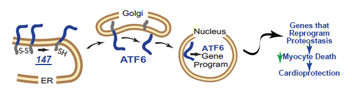

Pharmacologic activation of stress-responsive signaling pathways provides a promising approach for ameliorating imbalances in proteostasis associated with diverse diseases. However, this approach has not been employed in vivo. In recent research done in the Glembotski lab, we used a mouse model of myocardial ischemia/reperfusion to show that selective pharmacologic activation of the ATF6 arm of the unfolded protein response (UPR) during reperfusion with a new drug candidate we discovered in collaboration with scientists at The Scripps Research Institute, code named 147, transcriptionally reprogrammed proteostasis, ameliorated damage and preserved heart function in mice.

These effects were lost upon cardiac myocyte-specific Atf6 deletion in the heart, demonstrating the critical role played by ATF6 in mediating pharmacologically activated proteostasis-based protection of the heart. Pharmacological activation of ATF6 was also protective in renal and cerebral ischemia/reperfusion models, demonstrating its widespread utility. Thus, pharmacologic activation of ATF6 represents a first-in-class proteostasis-based therapeutic strategy for ameliorating ischemia/reperfusion damage, underscoring its unique translational potential for treating a wide range of pathologies caused by imbalanced proteostasis.
