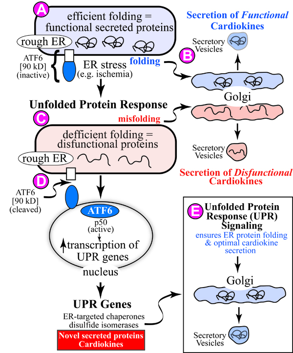

In efforts to develop novel therapies of treating heart disease, research in the Glembotski lab is focused on how to deliver cardioprotective agents to the heart without leaving a genetic footprint. One method to accomplish this is to deliver protective proteins directly to the heart using state-of-the-art protein formulation and transduction methods. One such method involves combining Tat- and Arg-9-mediated methods of protein transduction, with we identified as cardioprotective. To accomplish this, members of the lab have patented technologies for the generation of chimeric proteins so that the transduction domains are removed from the bioactive region of the proteins within cells of the heart. This approach has been used to develop a new therapeutic platform that can be applied in the future to the delivery of essentially any protective protein to any tissue of interest. Members of the Glembotski lab are encouraged to design novel therapeutic platforms, such as this, in order to optimize the application of our basic science research efforts to a therapeutic setting.

